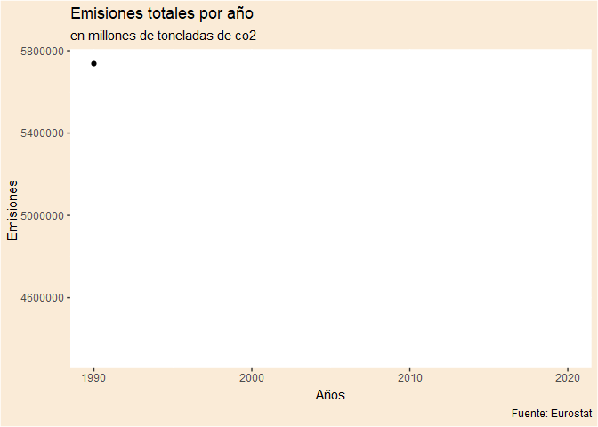
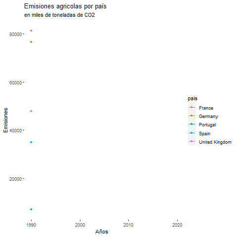
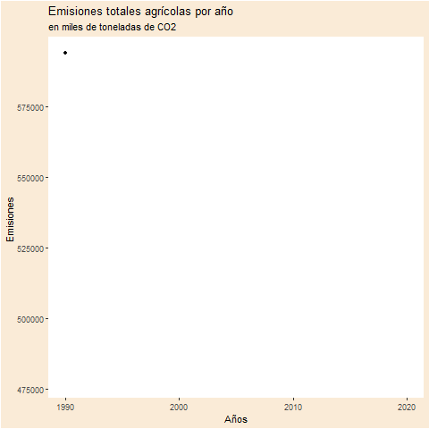

```{r chunk-setup, include = FALSE}
knitr::opts_chunk$set(echo = TRUE, eval = TRUE, message = FALSE, warning = FALSE, 
                      #results = "hold",
                      cache = FALSE, cache.path = "/caches/", comment = "#>",
                      #fig.width = 7, #fig.height= 7,   
                      #out.width = 7, out.height = 7,
                      collapse = TRUE,  fig.show = "hold",
                      fig.asp = 0.628, out.width = "75%", fig.align = "center")
knitr::opts_chunk$set(dev = "png", dev.args = list(type = "cairo-png"))

```

```{r options-setup, include = FALSE}
options(scipen = 999) #- para quitar la notación científica
options("yaml.eval.expr" = TRUE) 

```

```{r klippy, echo = FALSE}
klippy::klippy(position = c("top", "right")) #- remotes::install_github("rlesur/klippy")

```

<hr class="linea-black">


Trabajo elaborado para la asignatura "Programación y manejo de datos en la era del Big Data" de la Universitat de València durante el curso 2021-2022. El repo del trabajo está [aquí](https://github.com/damianps14/trabajo_BigData_equipo){target="_blank"}. 


La página web de la asignatura y los trabajos de mis compañeros pueden verse [aquí](https://perezp44.github.io/intro-ds-21-22-web/07-trabajos.html){target="_blank"}.

<hr class="linea-red">

# 1. Introducción 

```{r, echo = FALSE, eval = TRUE}
knitr::include_graphics(here::here("imagenes", "imagen.jpg")) 

```

Hoy en día, los problemas medioambientales son cada vez mayores y es imposible que pasen desapercibidos. En este trabajo, centramos el análisis en las emisiones contaminantes provenientes de la agricultura, sacando así varias conclusiones, y relacionándolas con el total de emisiones contaminantes existentes, en los países europeos. Además, hacemos un pequeño hincapié acerca de la importancia del combustible en la producción agrícola.

# 2. Proceso de los datos 

## Primeros pasos

Primero, cargamos todos los paquetes que vamos a utilizar. Los datos los hemos descargado desde [Eurostat](https://appsso.eurostat.ec.europa.eu/nui/show.do?dataset=env_air_gge&lang=en) y pasado a la carpeta datos en formato xlsx (excel). Finalmente, importamos los datos a R.

Los datos extraídos, tanto las emisiones totales como las agrícolas, están expresadas en miles de toneladas de CO2. 

```{r packages-setup, include = FALSE}
library(tidyverse)
library(klippy) #-remotes::install_github("rlesur/klippy")
library(rio)
library(gganimate)
library(sf)
library(rnaturalearth)
library(gt) #install.packages("gt")
library(wordcloud2) #install.packages("wordcloud2")
library(ggThemeAssist)
library(treemap)
library(treemapify) #install.packages(“treemapify”)
library(knitr)
library(plotly)
library(kableExtra)

```

```{r, eval = TRUE}
agricultura_emisiones <- rio::import(here::here("datos", "emisiones_agricultura.xlsx"))
total_emisiones <- rio::import(here::here("datos", "emisiones_totales.xlsx"))
combustible_emisiones <- rio::import(here::here("datos", "combustibles_agricultura.xlsx"))

```

```{r, eval = TRUE}
#Pasamos los datos a formato largo y renombramos la variable “GEO/TIME” por la variable “País”

df_agri <- agricultura_emisiones %>% pivot_longer(cols = 2:31, names_to = "year", values_to = "emisiones_agri") %>% rename (pais = "GEO/TIME") 
df_emi <- total_emisiones %>% pivot_longer(cols = 2:31, names_to = "year", values_to = "emisiones_totales") %>% rename (pais = "GEO/TIME")
df_comb <- combustible_emisiones %>% pivot_longer(cols = 2:31, names_to = "year", values_to = "emisiones_comb") %>% rename (pais = "GEO/TIME")

#Cambios los nombres de algunos países que nos dificultan el análisis

df_emi$pais <- recode(df_emi$pais, 
                          "Germany (until 1990 former territory of the FRG)" = "Germany",
                          "United Kingdom" = "UK")
df_agri$pais <- recode(df_agri$pais, 
                          "Germany (until 1990 former territory of the FRG)" = "Germany",
                          "United Kingdom" = "UK")
df_comb$pais <- recode(df_comb$pais, 
                          "Germany (until 1990 former territory of the FRG)" = "Germany",
                          "United Kingdom" = "UK")

#Ponemos la variable “year” como numérica

df_agri <- transform(df_agri, year = as.numeric(year))
df_emi <-  transform(df_emi, year = as.numeric(year))
df_comb <- transform(df_comb, year = as.numeric(year))

#Eliminamos los data frames que están en formato ancho

rm(agricultura_emisiones, combustible_emisiones, total_emisiones)

```

# 3. Totalidad de emisiones de gases efecto invernadero {.tabset .tabset-pills}

La consecuencias de la producción agrícola pueden ser varias: la erosión del suelo, sobreexplotación, el uso excesivo de químicos, el agotamiento de los acuíferos o bien la reducción de la biodiversidad.

La reducción de dichos efectos se puede llevar a cabo mediante la rotación y diversidad de cultivos, la siembra directa, la apuesta por las energías renovables que son respetuosas con el medio ambiente y una buena gestíón del agua ya que es muy importante para la supervivencia de los seres vivos. 
Nos hemos centrado, por tanto, en las emisiones agrícolas.

En el gráfico animado, vemos que las emisiones totales han disminuido en más de un millón de toneladas, con una fuerte bajada en 2008 por la crisis financiera.

Mediante la tabla realizada, podemos observar que los 5 países que más emisiones de CO2 han lanzado a la atmósfera desde 1990 son Alemania, Reino Unido, Italia, Francia y Polonia. Son los grandes paises industriales en productos de media y alta tecnología de Europa e incluso del mundo y este sector es el más contaminante de todos.

## Gráfico



## Código

```{r, message = FALSE, warning = FALSE, eval = FALSE, fig.align = "center"}
#Gráfico animado

df_totales <- df_emi %>%
  group_by(year) %>%
  summarise(emisiones_totales = sum(emisiones_totales))

dd <- ggplot(df_totales, aes(y = emisiones_totales,
                                 x = year)) +
  geom_line() +
  geom_point() +
  scale_x_continuous(breaks = seq(1990, 2020, 10), limits = c(1990, 2020)) + 
  theme(panel.background = element_rect(fill = "gray100"),
        plot.background = element_rect(fill = "antiquewhite")) +
  labs(title = "Emisiones totales por año",
    x = "Años", y = "Emisiones ", subtitle = "en millones de toneladas de co2",
    caption = "Fuente: Eurostat") +
  transition_reveal(year)
#- anim_save("./imagenes/emi_totales.gif", dd)

dd

```

## Tabla

```{r, echo = FALSE, eval = TRUE, results = TRUE}
df_emi_nombres <- df_emi %>% 
  group_by(pais) %>% 
  summarise(emisiones_totales = sum(emisiones_totales)) %>% 
  ungroup() %>% 
  slice_max(emisiones_totales, n = 5) %>%
  arrange(desc(emisiones_totales)) %>%
  rename("Paises" = pais, "Emisiones totales" = emisiones_totales)

gt(df_emi_nombres) %>% 
  tab_header(title = md("**Sumatorio de emisiones totales desde 1990**"),
             subtitle = "Los 5 paises más contaminantes") %>%
  tab_source_note(md("Fuente: [EUROSTAT](https://appsso.eurostat.ec.europa.eu/nui/show.do?dataset=env_air_gge&lang=en)"))

```

## Otra forma de visualizar los datos 

Y para mostrar los datos de manera más visual, hemos realizado lo siguiente.

```{r, fig.height = 2, fig.width = 5 ,dpi = 150,fig.align = "center", eval= TRUE, echo= FALSE}
df_emi_nombres <- df_emi %>% 
  group_by(pais) %>% 
  summarise(emisiones_totales = sum(emisiones_totales)) %>% 
  ungroup() %>% 
  arrange(desc(emisiones_totales))
  
  wordcloud2(data = df_emi_nombres, size = 0.5)
  
```

# 4. Análisis de las emisiones agrícolas {.tabset .tabset-pills}

Las emisiones agrícolas son aquellas procedentes de la producción agropecuaria.

Gracias a nuestros cálculos, podemos afirmar que, en el año 1990, los cinco países (en orden descendente) que más emisiones agrícolas lanzaban a la atmósfera eran: Francia, Alemania, Polonia, Reino Unido y Turquía y, en cambio, en el 2019 fueron: Francia, Turquía, Alemania, Reino Unido pero también España se posiciona como quinta en el ránking. 
Estos países son grandes y disponen de amplias superficies cultivables y cercanas al mar. Sustentan una gran parte de la producción agropecuaria europea. Es por ello que las emisiones tendrán más peso.
Por tanto, los países más contaminantes en la agricultura han sido prácticamente los mismos, lo que ha variado ha sido su posición. 

También, podemos sacar conclusiones sobre los países que menos emisiones agrícolas han lanzado a la atmósfera. Los 5 que menos en 1990, han sido: Malta, Chipre, Islandia, Luxemburgo y Eslovenia y en 2019 Estonia sustituye a Eslovenia.
Esto se debe al tamaño del territorio, ya que su reducida extensión provoca que las superficies cultivables sean muy reducidas y prioricen llevar a cabo otro tipo de actividades, como industria o servicios, entre otros.

Todo esto aparece plasmado en las tablas siguientes.

## Tabla 1

```{r, echo = FALSE, eval = TRUE}
impact_max <- df_agri %>% 
  filter(year %in% c(1990, 2019)) %>%
  group_by(year) %>% 
  select(pais, year, emisiones_agri) %>% 
  slice_max(emisiones_agri, n = 5) %>%
  rename("Países" = pais, "Años" = year, "Emisiones agrícolas" = emisiones_agri)
gt_eu <- gt(impact_max) %>% 
  tab_header(title = md("**Los 5 países con más emisiones agrícolas**"),
             subtitle = "entre 1990 y 2019") %>%
  tab_source_note(md("Fuente: [EUROSTAT](https://appsso.eurostat.ec.europa.eu/nui/show.do?dataset=env_air_gge&lang=en)"))

gt_eu

```

## Tabla 2

```{r,  echo = FALSE, eval = TRUE}
impact_min <-  df_agri %>%
  filter(year %in% c(1990, 2019)) %>%
  group_by(year) %>% 
  select(pais, year, emisiones_agri) %>%
  slice_min(emisiones_agri, n = 5) %>%
  rename("Países" = pais, "Años" = year, "Emisiones agrícolas" = emisiones_agri)

gt_eu <- gt(impact_min) %>% 
  tab_header(title = md("**Los 5 países con menos emisiones agrícolas**"),
             subtitle = "entre 1990 y 2019") %>%
  tab_source_note(md("Fuente: [EUROSTAT](https://appsso.eurostat.ec.europa.eu/nui/show.do?dataset=env_air_gge&lang=en)"))

gt_eu

```

## La variación de las emisiones agrícolas entre 1990 y 2019 {.tabset .tabset-pills}

Además, calculamos la variación de las emisiones agrícolas, entre los años 1990 y 2019 y hemos obtenido que los 5 países que más han aumentado las emisiones agrícolas desde el primer año hasta el último han sido: Turquía, Irlanda, Chipre, España y Luxemburgo. 

En cambio, los que mas han reducido sus emisiones son: Latvia, Eslovaquia, Lituania, Bulgaria y Czechia. En los últimos años han reducido el peso del sector agrícola con respecto al total y han aumentado el peso de la industria y del sector servicios. Esto les permite diversificar su estructura productiva para fomentar el desarrollo económico sostenido y crear productos de mayor valor añadido que puedan competir internacionalmente.

En el primer gráfico animado, hemos seleccionado ciertos países que consideramos relevantes para nuestro análisis. Portugal ha mantenido práctimente sus emisiones, España las ha incrementado ligeramente y Francia, Alemania y R. Unido las han disminuido.

En el segundo gráfico animado se puede observar la evolución de las emisiones agrícolas totales, desde 1990 hasta 2019. Se pueden diferenciar tres grandes etapas:

En primer lugar, 1990-2005, se produce un fuerte descenso y después vuelven a aumentar. En segundo lugar, 2005-2015, las emisiones aumentan pero después siguen disminuyendo. Y finalmente, 2015-2019, que sufren un fuerte incremento.

```{r,  echo = FALSE, eval = TRUE}
crec_percent <- df_agri %>% 
  filter(year %in% c(1990,2019)) %>% 
  group_by(pais) %>% 
  mutate(crec_emisiones = emisiones_agri - first(emisiones_agri)) %>% 
  mutate(crec_emisiones_percent = crec_emisiones / first(emisiones_agri) * 100)

```

### Tabla 3

```{r,  echo=FALSE, eval=TRUE}
max_crec_perc <- crec_percent %>% 
  filter (year == 2019) %>% 
  arrange(crec_emisiones_percent) %>%
  ungroup() %>%
  slice_max(crec_emisiones_percent, n = 5) %>%
  rename("Países" = pais, "Años" = year, "Emisiones agrícolas" = emisiones_agri, "Variación de las emisiones" = crec_emisiones, "Variación porcentual" = crec_emisiones_percent) 

gt_eu <- gt(max_crec_perc) %>% 
  tab_header(title = md("**Los 5 países que más han aumentado sus emisiones agrícolas**"),
             subtitle = "entre 1990 y 2019") %>%
  tab_source_note(md("Fuente: [EUROSTAT](https://appsso.eurostat.ec.europa.eu/nui/show.do?dataset=env_air_gge&lang=en)"))

gt_eu

```

### Tabla 4

```{r,  echo=FALSE, eval=TRUE}
min_crec_perc <- crec_percent %>% 
  filter (year == 2019) %>% 
  arrange(crec_emisiones_percent) %>%
  ungroup() %>%
  slice_min(crec_emisiones_percent, n = 5) %>%
  rename("Países" = pais, "Años" = year, "Emisiones agrícolas" = emisiones_agri, "Variación de las emisiones" = crec_emisiones, "Variación porcentual" = crec_emisiones_percent) 

gt_eu <- gt(min_crec_perc) %>% 
  tab_header(title = md("**Los 5 países que más han reducido sus emisiones agrícolas**"),
             subtitle = "entre 1990 y 2019") %>%
  tab_source_note(md("Fuente: [EUROSTAT](https://appsso.eurostat.ec.europa.eu/nui/show.do?dataset=env_air_gge&lang=en)"))

gt_eu

```

### Mapa de coropletas

En el siguiente mapa múltiple se puede observar, en los años 1990, 2000, 2010 y 2019, como van creciendo o disminuyendo las emisiones agrícolas en los distintos países europeos gracias al cambio de color que se observa en ellos.

```{r, echo = FALSE, eval = TRUE}
world <- ne_countries(scale = "medium", returnclass = "sf")
world <- world %>% filter(subregion != "Antarctica") %>% filter(admin != "Greenland")
world <- world %>% select(name, iso_a3, geometry)


#Hacemos coincidir los nombres con el df de world

df_agri$pais <- recode(df_agri$pais, "Czechia" = "Czech Rep.",
                       "UK" = "United Kingdom")
#Unimos con world

df_join <- left_join (df_agri, world, by = c("pais" = "name"))

df_eu <- df_join %>%
  filter(year %in% c("1990", "2000", "2010", "2019")) %>%
  mutate(emisiones_4 = ntile(emisiones_agri, 4))

p_eu <- ggplot(df_eu, aes(fill = emisiones_4, geometry = geometry)) +
  geom_sf() +
  labs(title = "Emisiones agrícolas por pais",
       fill = "Emisiones") + 
  coord_sf(xlim = c(-15.00, 42.00), ylim = c(35.60, 71,10), expand = TRUE) +
  scale_fill_gradient("Emisiones agrícolas", high = "green", low = "white") + 
  facet_grid(year ~ .)

p_eu

```

### Gráfico

Esto mismo, se puede visualizar mediante el siguiente gráfico y además, destacamos en un color distinto, España.

```{r,  message = FALSE,  warning = FALSE,  results = TRUE, echo = FALSE , eval = TRUE}
df_agri2 <- df_agri %>%
  filter(year %in% c("1990", "2000", "2010", "2019")) %>%
  mutate(emisiones_agri = emisiones_agri/1000)

g1 <- ggplot(df_agri2,  aes(x = pais, y = emisiones_agri)) + 
        geom_col(fill = "steelblue") +
  geom_col(data = filter(df_agri2, pais == "Spain"), fill = "orange") + 
  coord_flip() +
  facet_grid(cols = vars(year)) + 
  theme(panel.background = element_rect(fill = "gray100")) +
  labs(title = "Emisiones agrícolas, por paises",
       x = "País", y = "Emisiones", subtitle = "en miles de toneladas de co2")

g1

```

### Otra forma de visualizar los datos

Y de esta manera tan visual, podemos observar aquellos países que más emisiones agrícolas totales, desde 1990, han lanzado a la atmósfera.

Con ello, se afirma que han sido Francia, Alemania, Turquía, Reino Unido y España los que han lanzado más emisiones agrícolas ya que su nombre aparece en una letra más grande. 

```{r, eval= TRUE, echo= FALSE}
#Sumamos la totalidad de las emisiones agrícolas por país entre los años 1990 y 2019

df_agri_nombres <- df_agri %>% 
  group_by(pais) %>% 
  summarise(emisiones_agri = sum(emisiones_agri)) %>%
  mutate(emisiones_agri = emisiones_agri/1000000) %>%
  ungroup() %>% 
  arrange(desc(emisiones_agri))

ggplot(df_agri_nombres, aes(area = emisiones_agri, fill = emisiones_agri, label = pais )) +
  geom_treemap() +
  geom_treemap_text(colour = "white", place = "centre",
                    grow = FALSE) +
  scale_fill_viridis_c(option = "D" , name = "", alpha = 0.8, begin = 0.3, end = 0.7, direction = 1,
                       guide = guide_colorbar( title = "Cantidad de emisiones, en millones de toneladas",
                                               direction = "horizontal", barheight = unit(2,
                                                                                          units = "mm"),
                                               barwidth = unit(50, units = "mm"), draw.ulim = F,
                                               title.position = 'top', title.hjust = 0.5, label.hjust = 0.5)) +
  theme(legend.position = "bottom") +
  scale_x_continuous(labels=function(value){format(value, scientific = FALSE)}) +
  labs(title = "Emisiones agrícolas por país",
       subtitle = "entre 1990 y 2019") + 
  theme(plot.title = element_text(hjust = 0.5)) +
  theme(plot.subtitle = element_text(hjust = 0.5))

```

### Gráficos animados







### Código

```{r, message = FALSE, warning = FALSE, eval = FALSE, fig.align = "center"}
#Calculamos las emisiones agrícolas totales por año

df_agri_totales <- df_agri %>%
  group_by(year) %>%
  summarise(emisiones_agri_totales = sum(emisiones_agri))

gg <- ggplot(df_agri_totales, aes(y = emisiones_agri_totales,
                                 x = year)) +
  geom_line() +
  geom_point() +
  scale_x_continuous(breaks = seq(1990, 2020, 10), limits = c(1990, 2020)) + 
  theme(panel.background = element_rect(fill = "gray100"),
        plot.background = element_rect(fill = "antiquewhite")) +
  labs(title = "Emisiones totales agrícolas, por año",
    x = "Años", y = "Emisiones ", subtitle = "en miles de toneladas de co2",
    caption = "Fuente: Eurostat") +
  transition_reveal(year)
#- anim_save("./imagenes/gg.gif", gg)

gg

#Gráfico animado

df_agri_x <- df_agri %>%
  filter(pais %in% c("Germany", "France", "Spain", "United Kingdom", "Portugal"))

anim_2 <- df_agri_x %>%
  ggplot(aes(x = year, y = emisiones_agri, group = pais, color = pais)) +
    geom_line() +
    geom_point() + 
  theme(panel.background = element_rect(fill = "gray100")) + 
  labs(title = "Emisiones agricolas, por país",
       x = "Años", y = "Emisiones", subtitle = "en miles de toneladas de co2", caption = "Fuente: Eurostat") +
  transition_reveal (year) 

#- anim_save("./imagenes/anim.gif", anim_2)

anim_2

```

# 5. Profundizamos el análisis en España {.tabset .tabset-pills}

Ahora, pasamos a realizar un análisis más exhaustivo de nuestro país.

En primer lugar, hemos querido destacar los 5 años que más emisiones agrícolas han habido y los 5 que menos.

Los 5 años que más emisiones agrícolas se han lanzado han sido del 2000 hasta el 2005 y en cambio, los que menos, 1991-1994 y después, en el 2012.
Por tanto, podemos afirmar que España no ha seguido la tendencia de la suma de todos los países europeos, durante los años 2000-2005, analizada en el apartado anterior. 

Todo esto se puede visualizar en la tabla realizada.

Y, en el gráfico de debajo, se puede observar la evolución de las emisiones agrícolas españolas durante todos los años. Durante el período estudiado, España ha aumentado sus emisiones. Esto es debido a la influencia de las políticas PAC, que han fomentado la actividad agrícola y por tanto las emisiones.

## Tabla 1 

```{r, echo = FALSE, eval = TRUE}
impact_max_esp <-  df_agri %>%
  filter(pais == "Spain") %>%
  slice_max(emisiones_agri, n = 5) %>%
  rename("País" = pais, "Años" = year, "Emisiones agrícolas" = emisiones_agri)

gt_esp1 <- gt(impact_max_esp) %>% 
  tab_header(title = md("**Los 5 años que más emisiones ha lanzado España**"),
             subtitle = "entre 1990 y 2019") %>%
  tab_source_note(md("Fuente: [EUROSTAT](https://appsso.eurostat.ec.europa.eu/nui/show.do?dataset=env_air_gge&lang=en)")) 

gt_esp1

```

## Tabla 2

```{r, echo = FALSE, eval = TRUE}
impact_min_esp <-  df_agri %>% 
  filter(pais == "Spain") %>%
  slice_min(emisiones_agri, n = 5) %>%
  rename("País" = pais, "Años" = year, "Emisiones agrícolas" = emisiones_agri)

gt_esp2 <- gt(impact_min_esp) %>% 
  tab_header(title = md("**Los 5 años que menos emisiones ha lanzado España**"),
             subtitle = "entre 1990 y 2019") %>%
  tab_source_note(md("Fuente: [EUROSTAT](https://appsso.eurostat.ec.europa.eu/nui/show.do?dataset=env_air_gge&lang=en)"))

gt_esp2

```

## Gráfico

En este gráfico, se observa la evolución de las emisiones agrícolas en España desde 1990 hasta 2019.

```{r, message = FALSE, warning = FALSE, results = TRUE,echo = FALSE , eval = TRUE}
df_esp <- df_agri %>%
  filter (pais == "Spain")

g3 <- ggplot(df_esp,  aes(x = year, y = emisiones_agri)) + 
        geom_col(fill = "lightgreen") +
  scale_x_continuous(breaks = seq(1990, 2020, 10), limits = c(1990, 2020)) + 
  theme(panel.background = element_rect(fill = "thistle1")) +
  labs(title = "Emisiones agrícolas en España",
    x = "Años", y = "Emisiones agrícolas",
    subtitle = "en miles de toneladas de CO2")

g3 + labs (caption = "Fuente: Eurostat")

```

## La variación de las emisiones agrícolas, entre 1990 y 2019 {.tabset .tabset-pills}

La variación que ha sufrido España en cuanto a las emisiones agrícolas entre los años 1990 y 2019 ha sido de aproximadamente de 8,01 %, como se puede observar en la tabla de abajo.

```{r, echo = FALSE, eval = TRUE}
crec_percent_esp <- df_agri %>% 
  filter(year %in% c(1990,2019), pais == "Spain") %>% 
  mutate(crec_emisiones = emisiones_agri - first(emisiones_agri)) %>% 
  mutate(crec_emisiones_percent = crec_emisiones / first(emisiones_agri) *100)

```

### Tabla 3

```{r, echo = FALSE, eval = TRUE, results = TRUE}
crec_percent_esp <- crec_percent_esp %>%
  rename("País" = pais, "Años" = year, "Emisiones agrícolas" = emisiones_agri, "Variación de las emisiones" = crec_emisiones, "Variación porcentual" = crec_emisiones_percent)

gt_esp <- gt(crec_percent_esp) %>% 
  tab_header(title = md("**Variación de las emisiones agrícolas en España**"),
             subtitle = "entre 1990 y 2019") %>%
  tab_source_note(md("Fuente: [EUROSTAT](https://appsso.eurostat.ec.europa.eu/nui/show.do?dataset=env_air_gge&lang=en)"))

gt_esp

```

# 6. Emisiones agrícolas vs Emisiones totales {.tabset .tabset-pills}

En este apartado, pretendemos llevar a cabo una comparación de las emisiones agrícolas con la totalidad de emisiones existentes.

```{r, echo = FALSE, eval = FALSE, warning = FALSE, message = FALSE}
#Juntamos los dos df para poder trabajar mejor en nuestros análisis 

df_totales <- df_emi %>%
  group_by(year) %>%
  summarise(emisiones_totales = sum(emisiones_totales))

df_left_join <- left_join(df_agri, df_totales, by = "year")

##Porcentaje de emisiones agrícolas sobre el total de emisiones para cada país

#Para cada año

df_comparacion_1 <- df_left_join %>%
  group_by(pais) %>%
  mutate(porcent_sobre_total = emisiones_agri/emisiones_totales * 100) %>%
  mutate(var_porcent = porcent_sobre_total - lag(porcent_sobre_total)) 

#Entre 1990 y 2019

df_comparacion_2 <- df_left_join %>%
  filter(year %in% c(1990,2019)) %>%
  group_by(pais) %>%
  mutate(porcent_sobre_total = emisiones_agri/emisiones_totales * 100) %>%
  mutate(var_porcent = porcent_sobre_total - first(porcent_sobre_total)) 

```

## Gráfico

Y, mediante este gráfico se puede observar dicha comparación, para el año 2019.
Vemos que representan un porcentaje muy bajo. 

En nuestro gráfico, la A representa las emisiones agrícolas (11,70%) y la letra B representa las emisones totales.

Las actividades agrícolas representan alrededor de un 2% del PIB. Es por ello que las emisiones tienen un papel reducido sobre el cómputo global.

```{r, message = FALSE, warning = FALSE, results = TRUE,echo = FALSE , eval = TRUE}
data <- data.frame(
  group = LETTERS[1:2],
  value = c(506550.8, 4327981))

data <- data %>% 
  arrange(desc(group)) %>%
  mutate(prop = value / sum(data$value) * 100) %>%
  mutate(ypos = cumsum(prop)- 0.5*prop )

p <- ggplot(data, aes(x="", y = prop, fill = group)) +
  geom_bar(stat = "identity", width = 1, color = "black") +
  coord_polar("y", start = 0) +
  theme_void() + 
  theme(legend.position = "none") +
  geom_text(aes(y = ypos, label = group), color = "black", size = 6) +
  scale_fill_brewer(palette="Set5")

p + labs(title = "Emisiones agrícolas sobre las emisiones totales",
     subtitle = "para el año 2019",
     caption = "Fuente: Eurostat")

```

## Tabla 1

En esta tabla intentamos plasmar los 5 países que mayor impacto de las emisiones agrícolas tienen sobre el total; éstos han sido: Francia, Turquía, Alemania, Reino Unido y España.

```{r, echo = FALSE, eval = TRUE, results = TRUE}
#Elegimos los 5 países con mayor porcentaje de emisiones agrícolas sobre el total para hacer la tabla

df_totales <- df_emi %>%
  group_by(year) %>%
  summarise(emisiones_totales = sum(emisiones_totales))

df_left_join <- left_join(df_agri, df_totales, by = "year")

df_comparacion_2 <- df_left_join %>%
  filter(year %in% c(1990,2019)) %>%
  group_by(pais) %>%
  mutate(porcent_sobre_total = emisiones_agri/emisiones_totales * 100) %>%
  mutate(var_porcent = porcent_sobre_total - first(porcent_sobre_total)) 

df_max_comp <- df_comparacion_2 %>%
  filter(year == 2019) %>%
  ungroup() %>%
  slice_max(porcent_sobre_total, n = 5) %>%
  rename("Paises" = pais, "Años" = year, "Emisiones agrícolas" = emisiones_agri, "Emisiones totales" = emisiones_totales, "% sobre el total" = porcent_sobre_total, "Variación porcentual" = var_porcent)

gt_max <- gt(df_max_comp) %>% 
  tab_header(title = md("**Los 5 paises con mayor porcentaje de emisiones agrícolas sobre el total**"),
             subtitle = "entre 1990 y 2019") %>%
  tab_source_note(md("Fuente: [EUROSTAT](https://appsso.eurostat.ec.europa.eu/nui/show.do?dataset=env_air_gge&lang=en)")) 

gt_max

```

## Tabla 2

De forma análoga, los que menos han sido: Malta, Chipre, Islandia, Luxemburgo y Estonia. Esto se debe a que estos paises pequeños donde la superficie cultivable es escasa y el sector agrícola es mínimo.

```{r, echo = FALSE, eval = TRUE}
df_totales <- df_emi %>%
  group_by(year) %>%
  summarise(emisiones_totales = sum(emisiones_totales))

df_left_join <- left_join(df_agri, df_totales, by = "year")

df_comparacion_2 <- df_left_join %>%
  filter(year %in% c(1990,2019)) %>%
  group_by(pais) %>%
  mutate(porcent_sobre_total = emisiones_agri/emisiones_totales * 100) %>%
  mutate(var_porcent = porcent_sobre_total - first(porcent_sobre_total)) 

df_min_comp <- df_comparacion_2 %>%
  filter(year == 2019) %>%
  ungroup() %>%
  slice_min(porcent_sobre_total, n = 5) %>%
  rename("Paises" = pais, "Años" = year, "Emisiones agrícolas" = emisiones_agri, "Emisiones totales" = emisiones_totales, "% sobre el total" = porcent_sobre_total, "Variación porcentual" = var_porcent)

gt_min <- gt(df_min_comp) %>% 
  tab_header(title = md("**Los 5 paises con menor porcentaje de emisiones agrícolas sobre el total**"),
             subtitle = "entre 1990 y 2019") %>%
  tab_source_note(md("Fuente: [EUROSTAT](https://appsso.eurostat.ec.europa.eu/nui/show.do?dataset=env_air_gge&lang=en)")) 

gt_min

```

# 7. La importancia del combustible en la agricultura {.tabset .tabset-pills}

Uno de los principales gases de efecto invernadero es el dióxido de carbono (CO2), entre otros como el óxido nitroso (N2O) y el metano (CH4).

Debido a la acción del hombre, a sus sistemas de producción y de consumo de energía a partir de la Revolución Industrial, la concentración de esos gases en la atmósfera está creciendo de forma constante. Y, a más concentración de CO2, más calor se queda atrapado dentro de la atmósfera terrestre. El mayor impulsor de ese calentamiento global es el CO2 y está ligado fundamentalmente a la quema de combustibles fósiles: el carbón, el petróleo y el gas.

Hace solo una década que la producción de biocombustibles a partir de plantas se acogió como una alternativa ecológica a los combustibles fósiles. Recientemente, se ha observado que es una solución que compite con la producción de alimentos y que no siempre resulta efectiva en la reducción de emisiones de gases de efecto invernadero o contaminantes atmosféricos.


## Tabla 1

Los 5 países europeos con mayor impacto del combustible en la agricultura en el año 1990 fueron: Francia, Alemania, Netherlands, Polonia e Itália. En cambio, en el 2019 Polonia, España, Francia, Turquía y Netherlands. 


```{r, echo=FALSE, eval=TRUE}
impact_comb <- df_comb %>%
  filter(year %in% c(1990, 2019)) %>%
  group_by(year) %>% 
  select(pais, year, emisiones_comb) %>% 
  slice_max(emisiones_comb, n = 5) %>%
  rename("Paises" = pais, "Años" = year, "Emisiones de combustible" = emisiones_comb)

gt_comb <- gt(impact_comb) %>% 
  tab_header(title = md("**Los 5 paises con mayor impacto del combustible sobre la agricultura**"),
             subtitle = "entre 1990 y 2019") %>%
  tab_source_note(md("Fuente: [EUROSTAT](https://appsso.eurostat.ec.europa.eu/nui/show.do?dataset=env_air_gge&lang=en)")) 

gt_comb

```

## Tabla 2

Mediante esta tabla, se puede visualizar las emisiones del combustible que tienen efecto sobre la producción agrícola durante los años de 1990, 2000, 2010 y 2019, es decir, cada 10 años aproximadamente. 

Hay países como Autria que han sufrido una dismunución desde el primer año al último, pero otros como Cypre, las han aumentado. 

```{r, warning = FALSE, messages = FALSE, echo = FALSE, eval = TRUE}

total_comb <- df_comb %>% 
  filter(year %in% c(1990, 2000, 2010, 2019)) %>% 
  group_by(year, pais) %>% 
  slice_max(emisiones_comb, n = 5) 

data_wide2 <- total_comb %>% 
              tidyr::pivot_wider(names_from = year, 
                                 values_from = emisiones_comb)

knitr::kable(data_wide2, 
             align = "c", 
             caption = "Emisiones de combustible que afectan a la agricultura:     1990-2000-2010-2019",
             digits = 2, 
             format.args = list(decimal.mark = ",", big.mark = ".")) %>%
  kableExtra::kable_styling(fixed_thead = list(enabled = T, 
                                               background = "lightgreen")) %>%
  column_spec(1, background = "lightgreen")
 
```

## Gráfico

En este gráfico circular, la letra A las emisiones procedentes del combustible (18,70%) y la letra B son las emisiones totales agrícolas.

```{r, message = FALSE, warning = FALSE, results = TRUE,echo = FALSE , eval = TRUE}
data_comb <- data.frame(
  group = LETTERS[1:2],
  value = c(Emisiones_combustible = 94680.73, Emisiones_agrícolas = 506550.8))

data_comb <- data_comb %>% 
  arrange(desc(group)) %>%
  mutate(prop = value / sum(data_comb$value) * 100) %>%
  mutate(ypos = cumsum(prop)- 0.5*prop )

p1 <- ggplot(data_comb, aes(x ="", y = prop, fill = group)) +
  geom_bar(stat = "identity", width = 1, color = "black") +
  coord_polar("y", start=0) +
  theme_void() + 
  theme(legend.position="none") +
  geom_text(aes(y = ypos, label = group), color = "black", size=6) +
  scale_fill_brewer(palette = "Set6")

p1 + labs(title = "Emisiones del combustible sobre las emisiones agrícolas",
     subtitle = "para el año 2019",
     caption = "Fuente: Eurostat" )

```

## Código

```{r, message = FALSE, warning = FALSE, eval = FALSE, fig.align = "center"}
#Tabla 1

impact_comb <- df_comb %>%
  filter(year %in% c(1990, 2019)) %>%
  group_by(year) %>% 
  select(pais, year, emisiones_comb) %>% 
  slice_max(emisiones_comb, n = 5) %>%
  rename("Paises" = pais, "Años" = year, "Emisiones de combustible" = emisiones_comb)

gt_comb <- gt(impact_comb) %>% 
  tab_header(title = md("**Los 5 paises con mayor impacto del combustible sobre la agricultura**"),
             subtitle = "entre 1990 y 2019") %>%
  tab_source_note(md("Fuente: [EUROSTAT](https://appsso.eurostat.ec.europa.eu/nui/show.do?dataset=env_air_gge&lang=en)")) 

gt_comb

#Tabla 2

total_comb <- df_comb %>% 
  filter(year %in% c(1990, 2000, 2010, 2019)) %>% 
  group_by(year, pais) %>% 
  slice_max(emisiones_comb, n = 5) 

data_wide2 <- total_comb %>% 
              tidyr::pivot_wider(names_from = year, 
                                 values_from = emisiones_comb)

knitr::kable(data_wide2, 
             align = "c", 
             caption = "Emisiones de combustible que afectan a la agricultura:     1990-2000-2010-2019",
             digits = 2, 
             format.args = list(decimal.mark = ",", big.mark = ".")) %>%
  kableExtra::kable_styling(fixed_thead = list(enabled = T, 
                                               background = "lightgreen")) %>%
  column_spec(1, background = "lightgreen")

#Gráfico

data_comb <- data.frame(
  group = LETTERS[1:2],
  value = c(Emisiones_combustible = 94680.73, Emisiones_agrícolas = 506550.8))

data_comb <- data_comb %>% 
  arrange(desc(group)) %>%
  mutate(prop = value / sum(data_comb$value) * 100) %>%
  mutate(ypos = cumsum(prop)- 0.5*prop )
p1 <- ggplot(data_comb, aes(x ="", y = prop, fill = group)) +
  geom_bar(stat = "identity", width = 1, color = "black") +
  coord_polar("y", start=0) +
  theme_void() + 
  theme(legend.position="none") +
  geom_text(aes(y = ypos, label = group), color = "black", size=6) +
  scale_fill_brewer(palette = "Set6")

p1 + labs(title = "Emisiones del combustible sobre las emisiones agrícolas",
     subtitle = "para el año 2019",
     caption = "Fuente: Eurostat" )

 
```


# 8. Conclusiones

Mediante este trabajo hemos intentado hacer un exhaustivo análisis de las emisiones agrícolas, haciendo hincapié en la totalidad de emisiones co2 y también la importancia del combustible en la agricultura.

Hemos podido observar la evolución completa de dichas variables ya que hemos realizado análisis tanto por años como por países intentando sacar conclusiones.
Muchas veces, resaltamos 5 años o 5 países para poder así comparar de manera más sencilla.

Para hacer frente a las emisiones agrícolas pensamos que es importante apostar por la innovación del sector agrícola, ya que ha sido un sector históricamente atrasado.
Por lo que, es necesario que dicho sector se adapte a las nuevas técnicas de cultivo existentes y su apuesta por las energías renovables.

# 9. Bibliografía

[Eurostat (2021): Greenhouse gas emissions by source sector (source: EEA)](https://appsso.eurostat.ec.europa.eu/nui/show.do?dataset=env_air_gge&lang=en)

[Tutoriales de la asignatura](https://perezp44.github.io/intro-ds-21-22-web/04-tutoriales.html)

Para llevar a cabo el trabajo, nos ha servido de gran ayuda los trabajos del año anterior colgados en la página web del curso, sobre todo, el de "Análisis del impacto ecológico" debido a la similitud del tema elegido. Se puede ver [aquí](https://rodri45l.github.io/trabajo_BigData_equipo/)

<br><br>

Bon nadal, MIAU!!

```{r, echo = FALSE, eval = TRUE}
knitr::include_graphics(here::here("imagenes", "gato-feliz-navidad.gif") )
```

<hr class="linea-red">
<hr class="linea-red">

```{r, echo = FALSE}
sessioninfo::session_info() %>% details::details(summary = 'Información de mi R-sesión:') 
```

<br><br>

<div class="tocify-extend-page" data-unique="tocify-extend-page" style="height: 0;"></div>
